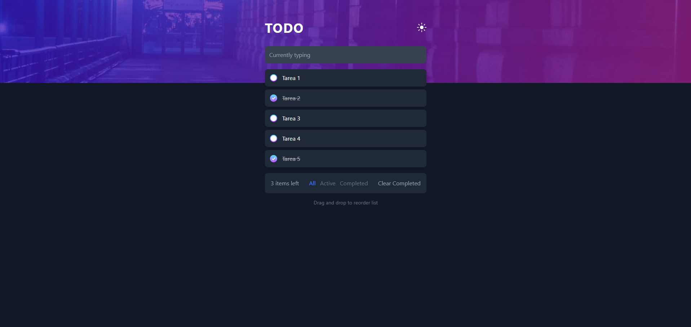

# Frontend Mentor - Solución TODO App

Esta es una solución para el [Desafío TODO App de Frontend Mentor](https://www.frontendmentor.io/challenges/todo-app-Su1_KokOW). Los desafíos de Frontend Mentor te ayudan a mejorar tus habilidades de escritura de código creando proyectos realistas.

## Tabla de contenidos

- [Descripción general](#descripción-general)
  - [El desafío](#el-desafío)
  - [Captura de pantalla](#captura-de-pantalla)
  - [Enlaces](#enlaces)
- [Mi proceso](#mi-proceso)
  - [Tecnologías utilizadas](#tecnologías-utilizadas)
- [Autor](#autor)

## Descripción general

### El desafío

Los usuarios deberían poder:

- Ver el diseño óptimo de la aplicación según el tamaño de la pantalla de su dispositivo
- Ver los estados de **hover** de todos los elementos interactivos de la página
- Agregar nuevas tareas pendientes a la lista
- Marcar tareas pendientes como completadas
- Eliminar tareas pendientes de la lista
- Filtrar por todas/activas/completadas
- Borrar todas las tareas pendientes completadas
- Alternar entre modo claro y oscuro
- **Bonus**: Arrastre y suelte para reordenar los elementos de la lista

### Captura de pantalla

### Enlaces

- Enlace del código en GitHub: [GitHub](https://github.com/AngelPereiraR/TodoApp-Opcional---Pereira-Rodriguez-Angel-Manuel)
- Enlace de la página desplegada: [Despliegue en Netlify](https://todoapp-frontend-mentor-angel-pereira.netlify.app/)

## Mi proceso

### Tecnologías utilizadas

- Marcado HTML5 semántico
- Flexbox
- Flujo de trabajo que prioriza los dispositivos móviles
- [React](https://reactjs.org/) - Biblioteca JS
- [Tailwind CSS](https://tailwindcss.com/) - Para estilos

## Autor

- Página web - [Ángel Manuel Pereira Rodríguez](https://portfolio-angelpereira.netlify.app/)
